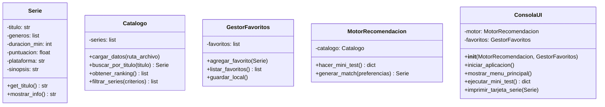

# Diagrama de clases — boceto inicial (TP0)

> Estado: boceto TP0. Se actualiza en entregas posteriores con la implementación real y la incorporación de estructuras de datos más complejas vistas en la materia.

