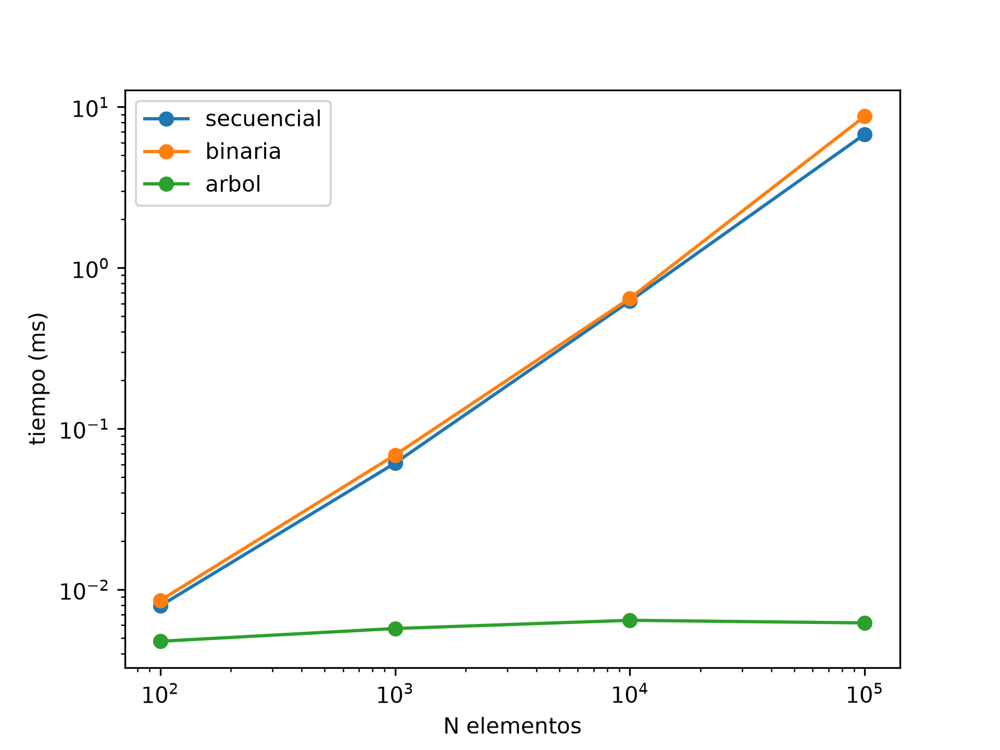

## 1. ¿Qué resolvimos?


## 2. Clave de ordenamiento


## 3. Prueba del árbol
Salida de `python -m algoritmos.probar_bst`:

```
Altura del árbol: 4

--- inorder (ordenado alfabéticamente) ---
  Serie: Breaking Bad Plataforma: Netflix ⭐Puntuacion: 9.5
  Serie: Dark Plataforma: Netflix ⭐Puntuacion: 8.8
  Serie: Game of Thrones Plataforma: HBO Max ⭐Puntuacion: 9.2
  Serie: Stranger Things Plataforma: Netflix ⭐Puntuacion: 8.7
  Serie: The Office Plataforma: Prime Video ⭐Puntuacion: 8.9

--- preorder ---
  Stranger Things
  Breaking Bad
  Game of Thrones
  Dark
  The Office

--- postorder ---
  Dark
  Game of Thrones
  Breaking Bad
  The Office
  Stranger Things

--- búsquedas ---
Buscar 'breaking bad': Serie: Breaking Bad Plataforma: Netflix ⭐Puntuacion: 9.5
Buscar 'zzz': None

```

## Problemas al ejecutar ```python algoritmos/probar_bst.py```

en caso de que arroje algun error el comando de ejecucion:

```python -m algoritmos.probar_bst```

intente ejecutando:

```python -m algoritmos.probar_bst```


## 4. Comparación de tiempos 


| N elementos | Secuencial (ms) | Binaria (ms) | Árbol BST (ms) |
|-----------|-----------|-----------|-------------  |
|100          |0.0079           |0.0086          |0.0048  |
|1000         |0.0611           |0.0686          |0.0057 |
|10000        |0.6220           |0.6471          |0.0064|
|100000        |6.7825           |8.7617          |0.0062|


```
tamaño  secuencial_ms   binaria_ms      arbol_ms
¡Éxito! Se cargaron 100 series al catálogo.
100     0.0079          0.0086          0.0048
¡Éxito! Se cargaron 1000 series al catálogo.
1000    0.0611          0.0686          0.0057
¡Éxito! Se cargaron 10000 series al catálogo.
10000   0.6220          0.6471          0.0064
¡Éxito! Se cargaron 100000 series al catálogo.
100000  6.7825          8.7617          0.0062
```



## 5. Análisis de complejidad


## 6. Conclusión


## 7. Errores o dudas que tuvimos

- problemas al ejecutar el comando `python algoritmos/probar_bst.py` la solucion fue ejecutar el script de la siguiente forma `python -m algoritmos.probar_bst`

- al ejecutar el script ocurria un error `RecursionError`, el problema era que el arbol estaba ordenado alfabeticamente por titulo, la solucion fue mezclar el orden utilizando random.shuffle antes de construirlo

```File "<frozen runpy>", line 203, in _run_module_as_main
  File "<frozen runpy>", line 88, in _run_code
  File "C:\Users\frias\OneDrive\Desktop\SerieMatch\algoritmos\experimentos\medicion.py", line 77, in <module>
    main()
    ~~~~^^
  File "C:\Users\frias\OneDrive\Desktop\SerieMatch\algoritmos\experimentos\medicion.py", line 65, in main
    t_bst = medir_arbol(catalogo.series, titulo_probe)
  File "C:\Users\frias\OneDrive\Desktop\SerieMatch\algoritmos\experimentos\medicion.py", line 40, in medir_arbol
    arbol.insertar(e, clave=lambda e: e.titulo.lower())
    ~~~~~~~~~~~~~~^^^^^^^^^^^^^^^^^^^^^^^^^^^^^^^^^^^^^
  File "C:\Users\frias\OneDrive\Desktop\SerieMatch\estructuras\arbol_binario.py", line 21, in insertar
    self._insertar_recursivo(self.raiz, dato, clave)
    ~~~~~~~~~~~~~~~~~~~~~~~~^^^^^^^^^^^^^^^^^^^^^^^^
  File "C:\Users\frias\OneDrive\Desktop\SerieMatch\estructuras\arbol_binario.py", line 33, in _insertar_recursivo
    self._insertar_recursivo(nodo.derecho, dato, clave)
    ~~~~~~~~~~~~~~~~~~~~~~~~^^^^^^^^^^^^^^^^^^^^^^^^^^^
  File "C:\Users\frias\OneDrive\Desktop\SerieMatch\estructuras\arbol_binario.py", line 33, in _insertar_recursivo
    self._insertar_recursivo(nodo.derecho, dato, clave)
    ~~~~~~~~~~~~~~~~~~~~~~~~^^^^^^^^^^^^^^^^^^^^^^^^^^^
  File "C:\Users\frias\OneDrive\Desktop\SerieMatch\estructuras\arbol_binario.py", line 33, in _insertar_recursivo
    self._insertar_recursivo(nodo.derecho, dato, clave)
    ~~~~~~~~~~~~~~~~~~~~~~~~^^^^^^^^^^^^^^^^^^^^^^^^^^^
  [Previous line repeated 990 more times]
  File "C:\Users\frias\OneDrive\Desktop\SerieMatch\estructuras\arbol_binario.py", line 24, in _insertar_recursivo
    if clave(dato) < clave(nodo.dato):
       ~~~~~^^^^^^
RecursionError: maximum recursion depth exceeded```
