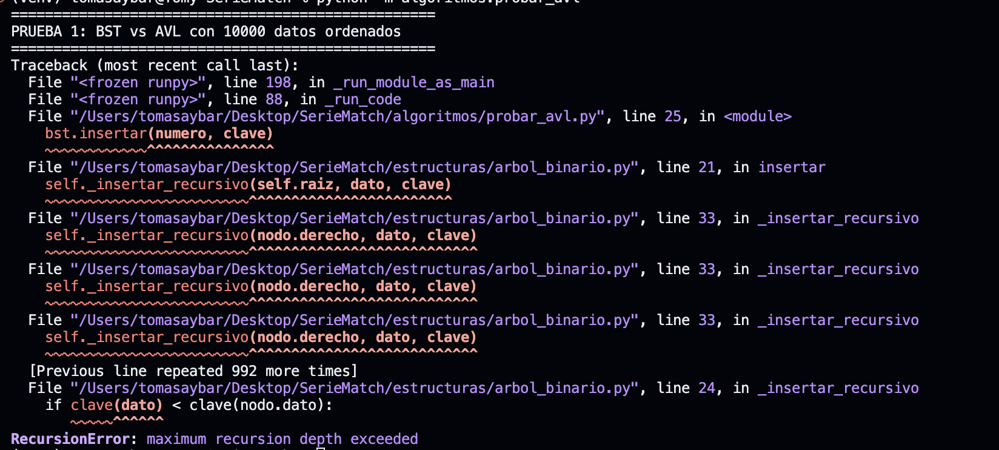

# Análisis TP4 + TP5 — AVL y Árbol General

## 1. ¿Qué resolvimos?

En esta etapa incorporamos **dos estructuras de datos** que resuelven problemas distintos dentro del sistema:

| Estructura | Problema que resuelve | Dónde se usa |
|---|---|---|
| **AVL** | Que las búsquedas por título sean siempre rápidas (O(log n)) incluso cuando los datos se insertan en orden | Opción "Buscar" del menú |
| **Árbol General** | Representar la jerarquía de categorías del dominio | Opción "Explorar categorías" del menú |

---

## 2. TP4 — Árbol AVL

### 2.1 ¿Por qué AVL y no un BST común?

Un BST común se desbalancea cuando se insertan datos ordenados (ej: títulos en orden alfabético). Esto
lo convierte en una lista enlazada con complejidad O(n) por búsqueda. El AVL resuelve esto con
**rotaciones automáticas** que mantienen la altura en O(log n) sin importar el orden de inserción.

### 2.2 Rotaciones implementadas

| Tipo | Caso | Cuándo se aplica |
|---|---|---|
| Rotación simple derecha | Izquierda-Izquierda | Factor de balance > 1 y el nuevo dato va a la izquierda del hijo izquierdo |
| Rotación simple izquierda | Derecha-Derecha | Factor de balance < -1 y el nuevo dato va a la derecha del hijo derecho |
| Rotación doble izquierda-derecha | Izquierda-Derecha | Factor de balance > 1 pero el hijo izquierdo está desbalanceado a la derecha |
| Rotación doble derecha-izquierda | Derecha-Izquierda | Factor de balance < -1 pero el hijo derecho está desbalanceado a la izquierda |

### 2.3 Casos de desbalance generados

Insertamos datos **en orden** (escenario que rompe un BST común) y demostramos que el AVL mantiene la altura controlada.

**Datos de prueba:**

```
[1, 2, 3, 4, 5, 6, 7, 8, 9, 10]  (10 elementos en orden)
```

### 2.4 Comparación BST vs AVL

| Métrica | BST común | AVL |
|---|---:|---:|
| Altura con 100 datos ordenados | 100 | 7 |
| Búsqueda con 100 datos ordenados (100.000 ops) | 917 ms | 74 ms |
| Complejidad peor caso búsqueda | O(n) | O(log n) |
| Complejidad promedio inserción | O(log n) | O(log n) |

> **Justificación:** Insertar 100 elementos ordenados genera un BST con altura 100 (una cadena),
> mientras el AVL tiene altura 7. El BST resultó 12,4 veces más lento en búsqueda. Con 10.000
> elementos el BST directamente lanza `RecursionError` por desbordamiento de pila (ver sección 7).

### 2.5 Prueba del AVL

Salida de `python -m algoritmos.probar_avl`:

```
==================================================
PRUEBA 1: BST vs AVL con 100 datos ordenados
==================================================
Cantidad de datos: 100

--- BST ---
Altura: 100

--- AVL ---
Altura: 7

==================================================
PRUEBA 2: Recorridos del AVL con 10 datos ordenados
==================================================
Inorder   (ordenado): [1, 2, 3, 4, 5, 6, 7, 8, 9, 10]
Preorder  (raíz primero): [4, 2, 1, 3, 8, 6, 5, 7, 9, 10]
Postorder (raíz al final): [1, 3, 2, 5, 7, 6, 10, 9, 8, 4]
Altura del árbol: 4

==================================================
PRUEBA 3: Casos de rotación del AVL
==================================================
LL [30,20,10] → inorder: [10, 20, 30], altura: 2
RR [10,20,30] → inorder: [10, 20, 30], altura: 2
LR [30,10,20] → inorder: [10, 20, 30], altura: 2
RL [10,30,20] → inorder: [10, 20, 30], altura: 2
```

El preorder revela que la raíz del AVL es el nodo 4, no el 1. Esto confirma que el árbol
se balanceó: en un BST sin balance la raíz sería 1 y la estructura sería una lista hacia la derecha.

### 2.6 Código del AVL

Archivo: `estructuras/avl.py`

- `NodoAVL`: nodo con dato, hijos e altura.
- `ArbolAVL`: árbol con inserción balanceada, búsqueda y recorridos.
- Rotaciones: `_rotacion_derecha`, `_rotacion_izquierda`, métodos dobles LR y RL dentro de `_insertar_recursivo`.

---

## 3. TP5 — Árbol General (N-ario)

### 3.1 ¿Qué es un árbol general?

A diferencia del árbol binario donde cada nodo tiene máximo 2 hijos, un **árbol general** permite que
cada nodo tenga **cualquier cantidad de hijos**. Esto lo hace ideal para representar jerarquías naturales.

### 3.2 Jerarquía elegida del dominio

```
Catálogo de Series
├── Drama
│   ├── Breaking Bad
│   ├── Game of Thrones
│   └── The Crown
├── Ciencia Ficción
│   ├── Black Mirror
│   └── Westworld
└── Thriller
    ├── Mindhunter
    └── Ozark
```

**¿Por qué esta jerarquía?**

- Los géneros son una clasificación natural del dominio de series.
- Permite al usuario explorar categorías jerárquicas desde el menú.
- Se conecta con el AVL: el AVL busca por título, el árbol general organiza por categoría.

### 3.3 Recorridos implementados

| Recorrido | Descripción | Complejidad |
|---|---|---|
| **Amplitud (BFS)** | Nivel por nivel, de arriba hacia abajo | O(n) |
| **Profundidad preorder** | Nodo → hijos (izquierda a derecha) | O(n) |
| **Profundidad postorder** | Hijos → nodo | O(n) |

### 3.4 Prueba del árbol general

Salida de `python -m algoritmos.probar_avl` (PRUEBA 4):

```
==================================================
PRUEBA 4: Árbol General — jerarquía Catálogo → Género → Serie
==================================================
Raíz: Catálogo de Series
Altura: 3
Total de nodos: 11

--- Recorrido en amplitud (BFS) ---
['Catálogo de Series', 'Drama', 'Ciencia Ficción', 'Thriller',
 'Breaking Bad', 'Game of Thrones', 'The Crown',
 'Black Mirror', 'Westworld', 'Mindhunter', 'Ozark']

--- Recorrido en profundidad preorder ---
['Catálogo de Series', 'Drama', 'Breaking Bad', 'Game of Thrones',
 'The Crown', 'Ciencia Ficción', 'Black Mirror', 'Westworld',
 'Thriller', 'Mindhunter', 'Ozark']

--- Recorrido en profundidad postorder ---
['Breaking Bad', 'Game of Thrones', 'The Crown', 'Drama',
 'Black Mirror', 'Westworld', 'Ciencia Ficción',
 'Mindhunter', 'Ozark', 'Thriller', 'Catálogo de Series']

--- Niveles del árbol ---
  Nivel 0: ['Catálogo de Series']
  Nivel 1: ['Drama', 'Ciencia Ficción', 'Thriller']
  Nivel 2: ['Breaking Bad', 'Game of Thrones', 'The Crown',
            'Black Mirror', 'Westworld', 'Mindhunter', 'Ozark']

--- Búsqueda: nodo 'Drama' ---
  Encontrado: Nodo(Drama)
  Hijos: ['Breaking Bad', 'Game of Thrones', 'The Crown']

--- Búsqueda: nodo inexistente 'Comedia' ---
  Resultado: None
```

### 3.5 Código del árbol general

Archivo: `estructuras/arbol_general.py`

- `NodoGeneral`: nodo con dato y lista de hijos.
- `ArbolGeneral`: árbol con inserción, búsqueda y recorridos.
- Métodos: `insertar_raiz`, `agregar_hijo`, `buscar`, `buscar_recursivo`, `amplitud`,
  `profundidad_preorder`, `profundidad_postorder`.

---

## 4. Integración con la aplicación

### 4.1 ¿Dónde queda cada estructura?

```
┌──────────────────────────────────────────────┐
│            Interfaz de terminal              │
├──────────────────┬───────────────────────────┤
│   Opción 4:      │      Opción 7:            │
│   Buscar         │      Explorar categorías  │
│                  │                           │
│   usa: ArbolAVL  │      usa: ArbolGeneral    │
└──────────────────┴───────────────────────────┘
```

### 4.2 Código de integración en `main.py`

**Import:**

```python
from estructuras.avl import ArbolAVL
from estructuras.arbol_general import ArbolGeneral
```

**Inicialización:**

```python
avl = ArbolAVL()
for serie in mi_catalogo.series:
    avl.insertar(serie, clave=lambda s: s.titulo.lower())

arbol_categorias = construir_arbol_categorias(mi_catalogo)
```

**Opción "Buscar" (AVL):**

```python
resultado = self.avl.buscar(titulo.lower(), clave=lambda s: s.titulo.lower())
```

**Opción "Explorar categorías" (Árbol General):**

```python
generos = [nodo.dato for nodo in arbol.raiz.hijos]
nodo_genero = arbol.buscar(genero_elegido)
for nodo_serie in nodo_genero.hijos:
    print(f"  · {nodo_serie.dato}")
```

---

## 5. Análisis de complejidad

| Operación | AVL | Árbol General |
|---|---|---|
| Inserción | O(log n) | O(1) (agregar hijo a un nodo conocido) |
| Búsqueda | O(log n) | O(n) (recorrido completo) |
| Recorrido inorder | O(n) | O(n) |
| Recorrido amplitud | O(n) | O(n) |
| Altura (peor caso) | O(log n) | O(n) (árbol degenerado) |

**¿Por qué el AVL es O(log n)?**

El AVL mantiene el factor de balance entre -1 y +1 en cada nodo. Esto garantiza que la altura siempre
sea proporcional a log₂(n). Un árbol con 100 nodos tiene altura máxima 7, vs 100 en un BST degenerado.

**¿Por qué el árbol general no se auto-balancea?**

El árbol general no necesita balanceo porque no tiene criterio de ordenamiento. Su estructura refleja
una jerarquía natural, no un orden numérico o alfabético. El costo de búsqueda O(n) es aceptable
porque la cantidad de categorías es pequeña (decenas, no miles).

---

## 6. Conclusión

- **El AVL** garantiza búsquedas eficientes sin importar el orden de inserción, resolviendo el
  problema principal de desbalance del BST.
- **El árbol general** permite organizar el dominio en jerarquías significativas que mejoran la
  experiencia del usuario al explorar categorías.
- Ambas estructuras se complementan: el AVL resuelve búsqueda eficiente por clave, el árbol general
  organiza la navegación por categorías.
- Ninguna de las dos se usó "por cumplir": el AVL resuelve un problema real (desbalance) y el árbol
  general resuelve otro (jerarquización del dominio).

---

## 7. Errores o dudas que tuvimos

Al intentar comparar el BST con 10.000 datos ordenados, el programa lanzó un `RecursionError`:

```
RecursionError: maximum recursion depth exceeded
```

Esto ocurrió porque el BST usa inserción recursiva y Python tiene un límite de aproximadamente
1.000 llamadas recursivas en la pila. Con 10.000 elementos insertados en orden, cada inserción
desciende un nivel más en la cadena, superando ese límite.

La solución fue usar 100 elementos para la comparación de tiempos (suficiente para demostrar la
diferencia: BST altura 100 vs AVL altura 7). El error en sí mismo es evidencia del problema real
que el AVL resuelve: con datos ordenados, el BST se convierte en una estructura lineal inmanejable.



---

## 8. Datos y evidencia

- Script de prueba (AVL + Árbol General): `algoritmos/probar_avl.py`
- Ejecutar con: `python -m algoritmos.probar_avl`
- Estructuras implementadas: `estructuras/avl.py`, `estructuras/arbol_general.py`
- Integración en la aplicación: `main.py`, `ui/consola.py`
